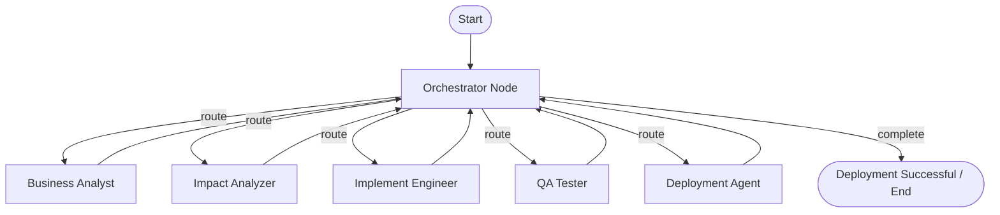

# Enterprise LangGraph Software Agency Automation

This project is an enterprise-grade multi-agent software development lifecycle (SDLC) automation system built using **LangGraph**. It coordinates six specialized agents in a **Supervisor-Worker (Hub-and-Spoke)** network pattern to design, implement, test, and deploy applications.

---

## Architecture and Flow

Rather than a simple linear pipeline, this system uses a central supervisor. The **Orchestrator** inspects the current execution state and dynamically selects the next specialized agent to execute.



### The 6 Specialized Agents
1. **Orchestrator Agent**: The brain of the system. Reads state history, checks logs/errors, and decides which agent to call next (routing table: `BusinessAnalyst`, `ImpactAnalyzer`, `ImplementEngineer`, `Tester`, `Deployer`, or `FINISH`).
2. **Business Analyst (BA) Agent**: Translates user requirements into functional specifications, acceptance criteria, and edge-case testing conditions.
3. **Impact Analyzer Agent**: Scans the pre-existing project workspace. Compares requirements to current files, maps out what files need to be edited or created, and compiles a list of target paths.
4. **Implement Engineer Agent**: Implements the required modifications across all modules (frontend, backend, database, configuration) and writes clean code. Also performs bug-fixes if QA reports errors.
5. **QA Tester Agent**: Saves files to disk and runs local validation checks:
   - Compile/Syntax verification on all source files.
   - Automatically detects and runs test suites (`test_*.py` or `*_test.py`).
6. **Deployment Agent**: Generates deployment scripts (`deploy.bat`, `deploy.sh`, or `deploy.py`) matching the target environment and executes them to verify production readiness.

---

## Advanced Enterprise Features

### 1. Context-Aware Smart File Scanner
To support massive codebases without blowing up your LLM's context window or wasting tokens, the system uses a **metadata-based directory indexer**:
* **Workspace Metadata Indexing**: On startup, it lists file paths, sizes, and line counts. It does **not** read any file contents into memory initially.
* **On-Demand Context Loading**: The **Impact Analyzer** queries the index to load the contents of only prompt-relevant files. The **Implement Engineer** loads only the contents of the target files slated for modification (`files_to_modify`).

### 2. Human-in-the-Loop (HITL) Interactive Checkpoints
You have full steering control over your agent team via interactive terminal gates. The execution automatically pauses at critical milestones:
* **Gate 1: Specifications Gate**: Displays the Business Analyst requirements spec. Press **Enter** to approve, or type your revisions (e.g., *"Make it use a PostgreSQL database instead of JSON"*). The BA will automatically re-draft the PRD.
* **Gate 2: Impact Gate**: Displays the proposed file changes list and risk analysis. Press **Enter** to approve, or type your adjustments. The Architect will update the files-to-change target map.

### 3. Docker Containerized Sandbox Execution
If Docker is installed and a `Dockerfile` exists in your workspace:
* The system builds a local container and executes tests inside it.
* If a `docker-compose.yml` exists, the deployment agent automatically deploys utilizing compose, keeping your host operating system clean and sandboxed.

---

## Supported Use Cases

This enterprise agent system is designed to work with all languages and platforms installed on your system. It supports three major workflows:

### 1. New Requirements (Starting from Scratch)
* **What it does**: Creates a brand new application from a high-level user prompt.
* **How to run**: Make sure the `workspace/` folder is empty.
  ```powershell
  python main.py --prompt "Create a Python command-line contacts manager that saves contacts to a JSON file and includes a test suite."
  ```
* **What happens**: The system scans the empty folder, creates a PRD, designs the file layout, writes the code, executes the test suite, and simulates a deployment run.

---

### 2. Existing Repository Bug Fixing / Feature Additions
* **What it does**: Modifies or adds features to a pre-existing codebase without destroying other working files.
* **How it works**:
  1. The program automatically scans all files inside the `workspace/` folder on startup.
  2. The scanned files are loaded into the LangGraph `codebase` state.
  3. The **Impact Analyzer** compares the prompt with the files, identifies the specific target files, and compiles the list of files to modify.
  4. The **Implement Engineer** edits only those files, leaving the rest of the project intact.
* **How to run**: Place your existing code in the `workspace/` subfolder, then run:
  ```powershell
  python main.py --prompt "FIX BUG: The add_contact function in contact.py crashes when a phone number contains spaces. Fix it and update tests."
  ```

---

### 3. Refactoring Codebase
* **What it does**: Restructures, cleans, or optimizes code inside your existing repository.
* **How to run**: Place your existing code in the `workspace/` folder, then run:
  ```powershell
  python main.py --prompt "Refactor codebase: Move database connection logic out of main.py and place it into a dedicated database.py utility file. Ensure imports are updated."
  ```
* **What happens**: The **Impact Analyzer** figures out that `main.py` needs to be edited and `database.py` needs to be created. The **Coder** moves the logic and updates the imports, while the **Tester** runs the test suite to ensure no regression bugs were introduced.

---

## Setup and Installation

1. **Activate Environment**:
   ```powershell
   cd "C:\PERSONAL DATA\2.POC\AGENTS"
   .venv\Scripts\Activate.ps1
   ```

2. **Configure API Keys and LLM Providers**:
   Make sure you have created your `.env` file:
   ```powershell
   copy .env.example .env
   ```
   Modify `.env` to configure your preferred provider:
   
   * **For Google Gemini (Default)**:
     ```properties
     LLM_PROVIDER=gemini
     GEMINI_API_KEY=your_gemini_api_key_here
     GEMINI_MODEL=gemini-2.5-flash
     ```
     
   * **For Ollama (Local LLM)**:
     Ensure Ollama is running locally on your system, then set:
     ```properties
     LLM_PROVIDER=ollama
     OLLAMA_MODEL=qwen2.5-coder:7b  # Or llama3, mistral, etc.
     OLLAMA_BASE_URL=http://localhost:11434
     ```


3. **Verify Graph System**:
   Before running live queries against the LLM, verify the system logic by running the mock validation suite:
   ```powershell
   python test_graph.py
   ```
   If it prints `[SUCCESS] Enterprise multi-agent orchestration validated successfully!`, your system is correctly configured.

4. **Launch Web UI Studio Dashboard**:
   To avoid typing commands in the CLI and get a beautiful interface to manage requirements, view real-time logs, inspect generated files, and handle HITL approvals:
   ```powershell
   python app.py
   ```
   Once started, open your browser and navigate to:
   👉 **`http://localhost:8000`**

